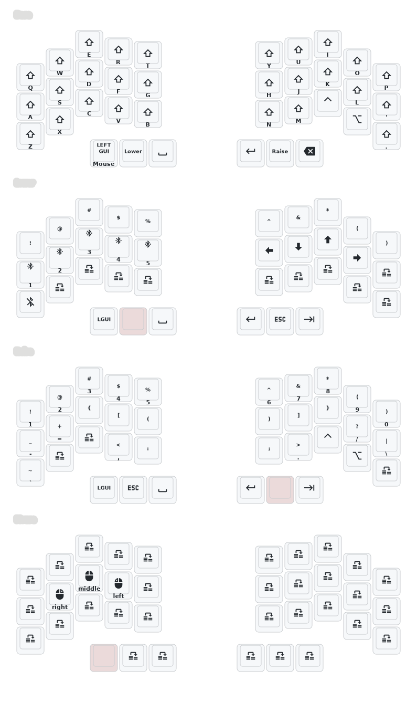

Use this template to customize and play with your 36 Key setup

### Default Firmware Keymap

### Fusion 360 mode (left trackball as space mouse)

Toggle the **Fusion** layer with the bottom-right key on the **Lower** layer (hold left `&mo 1` thumb key, press bottom-right). Toggle again to exit. While the Fusion layer is on, typing works as normal, and:

| Action | How | What it sends |
|---|---|---|
| Zoom | roll left ball (nothing held) | scroll wheel |
| Orbit | hold **H** + roll left ball | Shift + middle-drag |
| Pan | hold **J** + roll left ball | middle-drag |
| Mouse clicks | left home row: **S** = right, **D** = middle, **F** = left | mouse buttons |

The right trackball keeps working as a normal pointer on the Fusion layer, and the left home row carries the same mouse clicks as the Mouse layer, so no layer-holding is needed while in CAD.

Implementation: the left half sends raw XY over the split; `&trackball_peripheral_listener` in `config/crosses.keymap` maps it to scroll by default and switches to XY passthrough on the Orbit/Pan layers, which are held via macros that also hold the mouse button. See CLAUDE.md for details.
